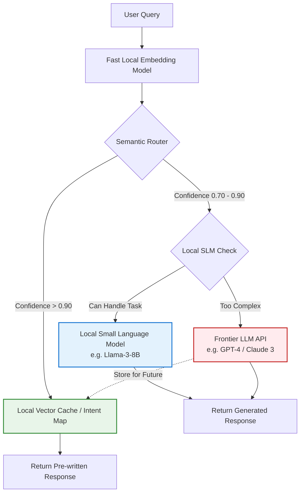

# Why Your Engineering Team Needs an AI Use Minimizer (And Fast)


Do you remember what happened around 2018? The entire tech industry suddenly woke up from a decade-long cloud migration hangover and realized their AWS bills were completely out of control. We had spent years spinning up massive EC2 instances, over-provisioning RDS databases, and abandoning orphaned EBS volumes like they were free candy. Then, the invoices finally reached the CFO's desk.

In response, a brand new role was born overnight: The Cloud FinOps Engineer. Their entire job was to rein in the chaos, implement auto-scaling rules, buy reserved instances, and aggressively downsize. 

It's 2026, and we are repeating the exact same cycle. But this time, it's not rogue EC2 instances. It's rogue LLM API calls.

I've been consulting with several mid-sized engineering teams recently, and the pattern is identical everywhere. A feature requires some basic data extraction or text classification, and instead of using a lightweight, purpose-built tool, a developer throws a massive, frontier-class model (like `gpt-4o` or `claude-3.5-sonnet`) at the problem. Multiply a $0.01 API call by five million monthly active users, and suddenly the company is burning $50,000 a month on AI overhead that provides zero marginal value to the actual business logic.

You don't just need AI engineers anymore. You need an **AI Use Minimizer**.

## What exactly is an AI Use Minimizer (AI FinOps)?

An AI Use Minimizer is essentially a FinOps engineer for the generative AI era, combined with a hardcore systems architect. Their entire job is to look at a product feature, review the pull request, and ask: *"How can we achieve this exact same outcome while using the absolute minimum amount of AI compute?"*

This isn't just about saving money (though finance will love them). It's about latency, reliability, and architectural elegance. Relying on a 3-second external API call to a third-party server for every single user interaction is a massive architectural anti-pattern. If the API provider goes down, your app goes down. 

The AI Use Minimizer operates on a few core principles and design patterns. Let's break them down.

### 1. LLM Cost Optimization via Semantic Routing

Not every query requires a genius model. If a user asks a chatbot, "What are your store hours?" or "How do I reset my password?", you do not need a trillion-parameter model to formulate the answer. 

A good minimizer implements semantic routing. Before a query ever touches an expensive LLM API, you embed the user's text using a blazing fast, tiny model (like `all-MiniLM-L6-v2`), and check it against a local vector cache of known intents. If the confidence score is high enough, you return a deterministic answer immediately. If it's a complex, novel query, *then* you route it to the expensive LLM.



With this architecture, 80% of your traffic never leaves your VPC, costs literal fractions of a cent, and resolves in 50 milliseconds instead of 3 seconds.

### 2. Aggressive AI Caching for LLM APIs

When I built [SchemaSense](/projects/schemasense), my AI database documentation tool, I initially made the rookie mistake of calling the API on every single table explanation request. Response times were hovering around 2.8 seconds, and my API quota was vanishing rapidly. 

I put on my AI Minimizer hat and added a simple SQLite caching layer. But you can't just cache by exact text match because users ask questions slightly differently. You have to cache semantically or by deterministic state. 

For SchemaSense, the cache key was a SHA256 hash of the database table schema itself. If the columns and types didn't change, the explanation wouldn't change. 

```python
# The AI Minimizer's approach to Caching LLM Responses
import hashlib
import json

async def get_table_explanation(table_schema_dict):
    # 1. Create a deterministic hash of the schema
    schema_string = json.dumps(table_schema_dict, sort_keys=True)
    schema_hash = hashlib.sha256(schema_string.encode()).hexdigest()
    
    # 2. Check ultra-fast local cache (Redis/SQLite)
    cached_explanation = await redis.get(f"explanation:{schema_hash}")
    
    if cached_explanation:
        return cached_explanation # Latency: 2ms, Cost: $0
        
    # 3. Only if cache misses, call the expensive LLM
    explanation = await call_expensive_llm(table_schema_dict) # Latency: 3000ms, Cost: $0.05
    
    # 4. Store it for the next time
    await redis.set(f"explanation:{schema_hash}", explanation)
    
    return explanation
```

First request: 2.8 seconds. Subsequent requests: 2ms. My hit rate jumped to 92%, and my API costs dropped to almost nothing. 

### 3. Downgrading to Deterministic Code

The most effective way to minimize AI use is to replace it entirely with traditional code. We've gotten lazy. Developers are using LLMs to parse JSON, extract dates from strings, or validate email addresses because it's easier than writing a regex or a proper parser. 

An AI Minimizer audits the codebase, identifies where LLMs are being used for deterministic tasks, and ruthlessly replaces them. 

```typescript
// ❌ What a lazy implementation looks like:
const response = await llm.chat("Extract the date from this string and format it as YYYY-MM-DD: 'Invoice generated on May 31, 2026'");
// Cost: $0.001 per run
// Latency: 800ms
// Reliability: 99% (sometimes it decides to say "Here is the date: 2026-05-31")

// ✅ What the AI Minimizer replaces it with:
const parsedDate = dateFns.parse(inputString, 'MMMM d, yyyy', new Date());
const formattedDate = dateFns.format(parsedDate, 'yyyy-MM-dd');
// Cost: $0.000
// Latency: 0.1ms
// Reliability: 100%
```

If a task *can* be solved with deterministic logic, it *must* be solved with deterministic logic. LLMs are for fuzzy reasoning, not exact parsing.

### 4. The Rise of Small Language Models (SLMs)

The era of defaulting to massive models is ending. We are realizing that an 8-billion parameter model running locally can do 80% of what a trillion-parameter model can do, provided the scope is narrow enough. 

The AI Use Minimizer champions the use of SLMs. A common workflow is to use the expensive frontier model for a month to generate high-quality outputs. The Minimizer takes those logs, uses them as a dataset to fine-tune a small, open-source model (like Llama-3 or Mistral), and deploys it internally using a tool like vLLM or Ollama. 

The data never leaves your VPC, ensuring complete data privacy. The marginal cost per query approaches zero, constrained only by your internal compute.

## Real-World Impact on LLM API Costs

I helped a client implement these strategies on a high-traffic customer support summarization feature. Here are the before and after metrics for a 30-day window processing 500,000 queries:

| Metric | Before (Naive Implementation) | After (AI Minimizer Architecture) | Improvement |
|--------|------------------------------|-----------------------------------|-------------|
| **Primary Model** | GPT-4o | Llama-3-8B (Local) + GPT-4o Fallback | Architecture Shift |
| **Average Latency** | 3.2 seconds | 180 milliseconds | **17x Faster** |
| **Cache Hit Rate** | 0% | 68% | Massive DB Offload |
| **Monthly Cost** | $4,500 | $150 (mostly server uptime) | **96% Savings** |

## Building the Culture

Having an AI Use Minimizer isn't just about tweaking code; it's a cultural shift for the engineering team. It's about moving away from the "AI-first" hype and moving toward "AI-when-necessary."

One of the best ways to enforce this is at the PR level. If a developer introduces a new call to an external LLM API, it requires a specific review from the Minimizer. They have to justify why a regex, a local embedding search, or a smaller local model couldn't do the job. 

If your company's AI strategy is currently just "send everything to the biggest API we can find and pass the cost to the user," you are building a house of cards on top of a massive operational expense. Hire a minimizer, or designate one internally. The era of free-flowing AI budgets is closing, and the teams that learn to do more with less will be the ones that actually survive the next phase of the industry.

---

## Connect With Me

- **GitHub**: [@amitdevx](https://github.com/amitdevx)
- **LinkedIn**: [Amit Divekar](https://www.linkedin.com/in/divekar-amit/)
- **X / Twitter**: [@amitdevx_](https://x.com/amitdevx_)
- **Instagram**: [@amitdevx](https://instagram.com/amitdevx)

If you have any questions or want to discuss this topic further, feel free to reach out!
