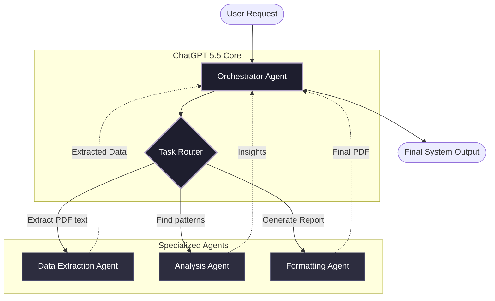

# ChatGPT 5.5 Agentic Workflows: Building Autonomous Systems that Actually Work

When I first architected **Professor Profiler** (an AI system that reverse-engineers university exam papers), the biggest bottleneck wasn't the data parsing; it was the sequential nature of LLM tool calling. In 2024, orchestrating multiple agents to analyze a syllabus, cross-reference past papers, and generate psychological profiles of professors required complex, fragile Python loops. 

Enter **ChatGPT 5.5**. 

The paradigm shifted entirely. ChatGPT 5.5 introduced native, deeply integrated reasoning loops and parallelized tool execution that fundamentally changed how we build autonomous architectures. Today, I want to walk through how you can leverage these features to build systems that don't just "chat," but actually *do work*.

## The Hub-and-Spoke Architecture

Traditional LLM workflows look like a straight line: User Input -> LLM -> Output. 
Multi-agent systems look like a chaotic web. To tame this chaos, I utilize a Hub-and-Spoke architecture, where a central "Orchestrator" agent (powered by ChatGPT 5.5) delegates tasks to specialized sub-agents.

Here is a look at the data flow:



## Parallel Tool Calling in Practice

The magic of ChatGPT 5.5 is that the `Router` doesn't have to wait for `Agent A` to finish before triggering `Agent B`. It can execute multiple tools simultaneously if there are no strict dependencies.

For example, when a user uploads 10 exam PDFs, the Orchestrator can trigger 10 parallel extraction processes instantly. In Python, using the latest OpenAI SDK, it looks something like this:

```python
import openai
import asyncio

client = openai.AsyncOpenAI()

async def analyze_documents(doc_ids):
    # ChatGPT 5.5 natively handles the parallel execution intent
    response = await client.chat.completions.create(
        model="gpt-5.5-turbo",
        messages=[
            {"role": "system", "content": "You are the Orchestrator. Analyze these documents in parallel using your available tools."},
            {"role": "user", "content": f"Process documents: {doc_ids}"}
        ],
        tools=[
            {
                "type": "function",
                "function": {
                    "name": "extract_exam_data",
                    "description": "Extracts questions from a PDF",
                    "parameters": { ... }
                }
            }
        ],
        tool_choice="auto",
        parallel_tool_calls=True  # The game changer
    )
    
    return response.choices[0].message
```

## Why This Matters

By offloading the parallel execution logic directly to the model, my Python codebase shrank by roughly 40%. The system became incredibly resilient; if one tool call fails, ChatGPT 5.5's internal reasoning loop catches the error, adjusts its parameters, and retries the specific failed node without crashing the entire workflow.

Building agentic workflows is no longer about writing endless `try/except` blocks. It's about writing clear, atomic tools and letting the model orchestrate the symphony.

---

## Connect With Me

- **GitHub**: [@amitdevx](https://github.com/amitdevx)
- **LinkedIn**: [Amit Divekar](https://www.linkedin.com/in/divekar-amit/)
- **X / Twitter**: [@amitdevx_](https://x.com/amitdevx_)
- **Instagram**: [@amitdevx](https://instagram.com/amitdevx)

If you have any questions or want to discuss this topic further, feel free to reach out!
