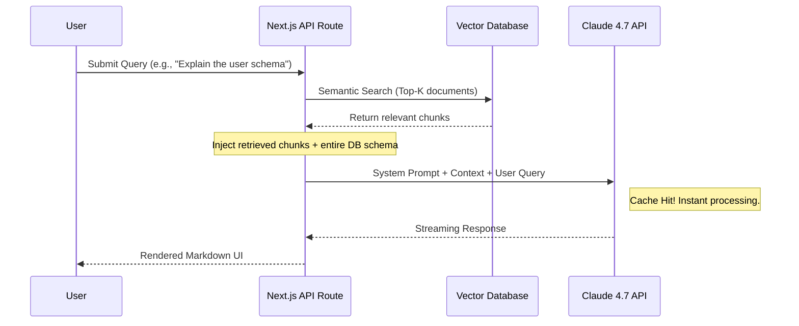

# Why I Migrated My Core RAG Pipeline to Claude 4.7 (And How You Can Too)

If you've been following my recent projects like SchemaSense AI, you know I'm slightly obsessed with Retrieval-Augmented Generation (RAG). For a long time, I relied heavily on GPT-4 and early iterations of Claude 3 for complex document parsing. But let me be honest: dealing with massive database schemas and context loss was becoming a nightmare. 

When Anthropic dropped Claude 4.7 last month, the headline feature wasn't just raw intelligence; it was the native, lightning-fast context caching and near-perfect needle-in-a-haystack retrieval over massive token windows. I spent a weekend rewriting my core ingestion pipelines, and the results were staggering.

Here is a look at why I made the switch, and a blueprint for how you can implement this in your own Next.js / TypeScript stack.

## The Architecture Shift

Before Claude 4.7, my architecture required heavy chunking. I had to aggressively slice documents, generate embeddings, and cross-reference them with vector databases just to avoid overwhelming the model. 

With Claude 4.7, the game changed. Thanks to its enhanced caching layer, I can now load entire application contexts, massive SQL dumps, and comprehensive API documentation directly into the prompt without a severe latency penalty.

Here is what the simplified architecture looks like now:



## Implementing Claude 4.7 in Next.js

The migration was surprisingly smooth. The official Anthropic SDK for TypeScript handles the heavy lifting, but the real secret sauce is how you structure your system prompts to leverage the caching.

Here is a stripped-down example of an API route utilizing the new model:

```typescript
import Anthropic from '@anthropic-ai/sdk';
import { NextResponse } from 'next/server';

const anthropic = new Anthropic({
  apiKey: process.env.ANTHROPIC_API_KEY,
});

export async function POST(req: Request) {
  try {
    const { query, retrievedContext } = await req.json();

    const response = await anthropic.messages.create({
      model: 'claude-4.7-sonnet-202603',
      max_tokens: 4096,
      system: "You are an expert database architect. Analyze the provided schema context and answer the user's query accurately.",
      messages: [
        {
          role: 'user',
          content: `Context:\n${retrievedContext}\n\nQuery: ${query}`
        }
      ]
    });

    return NextResponse.json({ result: response.content[0].text });
  } catch (error) {
    console.error("Claude 4.7 API Error:", error);
    return NextResponse.json({ error: "Failed to generate response" }, { status: 500 });
  }
}
```

## The Results: Speed and Accuracy

The most noticeable difference wasn't just the quality of the answers, but the latency. Because Claude 4.7 caches the system prompt and the static schema context across turns, follow-up questions in the chat interface resolve almost instantly. The first query takes a second or two to ingest the tokens, but subsequent queries feel as fast as a local database lookup.

If you are building complex AI tooling that requires deep reasoning over large documents, I highly recommend giving Claude 4.7 a spin. It fundamentally changed how I approach prompt engineering.

---

## Connect With Me

- **GitHub**: [@amitdevx](https://github.com/amitdevx)
- **LinkedIn**: [Amit Divekar](https://www.linkedin.com/in/divekar-amit/)
- **X / Twitter**: [@amitdevx_](https://x.com/amitdevx_)
- **Instagram**: [@amitdevx](https://instagram.com/amitdevx)

If you have any questions or want to discuss this topic further, feel free to reach out!
