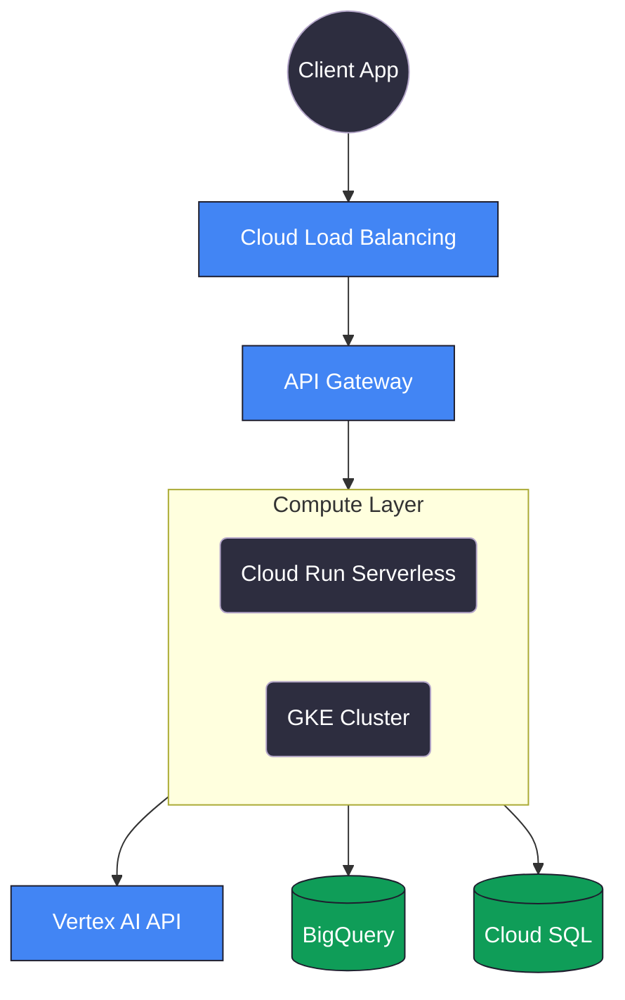

# GCP Cloud Run vs GKE in 2026: Architecting for High-Throughput AI Workloads

As a Cloud Architect, the most frequent debate I encounter when designing infrastructure for AI startups is whether to deploy inference servers on **Cloud Run** or **Google Kubernetes Engine (GKE)**. 

In 2024, the answer was usually straightforward: if you needed GPU access, you went to GKE. If you were just proxying API calls, you used Cloud Run. But in 2026, the lines have blurred significantly. Both platforms now offer extraordinary scale, and making the wrong choice early on can lead to massive technical debt or ballooning cloud bills.

This guide is the result of architecting production AI systems on both platforms over the past two years. Every recommendation here comes from real deployments, real cost analysis, and real outage post-mortems.

## Understanding the Fundamentals

Before diving into recommendations, let me clarify what each platform actually does under the hood, because the marketing descriptions can be misleading.

### Cloud Run: Managed Containers, Not "Serverless Functions"

Cloud Run is *not* Google's equivalent of AWS Lambda. It runs full Docker containers. You give it a container image, and it handles scaling, TLS, load balancing, and zero-downtime deployments. The container can run any language, any framework, any binary. The "serverless" part is that you don't manage the underlying VMs.

Key characteristics:
- Scales from 0 to 1,000 instances automatically
- Each instance handles up to 250 concurrent requests (configurable)
- Maximum request timeout of 60 minutes
- CPU can be allocated even when idle (the `cpu-throttling` flag)
- No GPU support (as of April 2026)

### GKE: Full Kubernetes with Google's Infrastructure

GKE gives you a managed Kubernetes cluster. Google handles the control plane (API server, etcd, scheduler), but you manage the node pools, pod configurations, networking, and everything that runs inside the cluster.

Key characteristics:
- Full control over node types, including GPU-attached nodes
- Autopilot mode removes node management (Google picks the hardware)
- Standard mode gives you control over every aspect
- Supports persistent volumes, StatefulSets, DaemonSets
- Integrates with Istio service mesh, GKE Gateway API

## The Architectural Comparison

Here is how a typical AI-driven backend sits on GCP today:



## When to Choose Cloud Run (And How to Optimize It)

Cloud Run is my default choice for approximately 80% of production workloads. Here is exactly when and why.

### Ideal Use Cases

**1. API Proxy Layers for External AI Services**

If your application calls OpenAI, Anthropic, Vertex AI, or any other managed LLM provider, Cloud Run is the obvious choice. Your container is essentially a sophisticated proxy that handles authentication, rate limiting, request validation, and response streaming. There is no need for Kubernetes complexity.

**2. Bursty or Unpredictable Traffic**

If your application sees zero traffic at 3 AM and massive spikes at 9 AM (common for B2B SaaS), Cloud Run's scale-to-zero capability saves thousands of dollars monthly compared to maintaining always-on GKE nodes.

**3. Small to Medium Teams**

Managing Kubernetes manifests, Helm charts, node pools, and pod disruption budgets requires dedicated DevOps bandwidth. Cloud Run lets Full-Stack Engineers deploy containers via `gcloud run deploy` and get back to writing application code.

### Production Cloud Run Configuration

Here is the exact Terraform configuration I use for deploying a FastAPI inference proxy on Cloud Run. Every parameter is chosen deliberately:

```hcl
# cloud_run.tf
resource "google_cloud_run_v2_service" "ai_proxy" {
  name     = "ai-inference-proxy"
  location = "asia-south1"  # Mumbai region for Indian users
  ingress  = "INGRESS_TRAFFIC_ALL"

  template {
    # Scaling configuration
    scaling {
      min_instance_count = 1   # Prevents cold starts for the first user
      max_instance_count = 100 # Cap to prevent runaway costs
    }

    # Execution environment
    execution_environment = "EXECUTION_ENVIRONMENT_GEN2"  # Use second-gen for better CPU

    # Container configuration
    containers {
      image = "asia-south1-docker.pkg.dev/my-project/ai-repo/inference-proxy:latest"
      
      resources {
        limits = {
          cpu    = "4"     # 4 vCPUs per instance
          memory = "8Gi"   # 8GB RAM for large request/response payloads
        }
        # CRITICAL: Keep CPU allocated even when the instance has no active requests.
        # Without this, background async operations (webhook callbacks, cache warming)
        # will be throttled to near-zero CPU.
        cpu_idle          = true
        startup_cpu_boost = true  # Faster cold starts
      }

      # Port configuration
      ports {
        container_port = 8080
      }
      
      # Environment variables
      env {
        name  = "VERTEX_AI_ENDPOINT"
        value = "https://asia-south1-aiplatform.googleapis.com"
      }
      env {
        name  = "MAX_CONCURRENT_REQUESTS"
        value = "80"
      }
      
      # Health check
      startup_probe {
        http_get {
          path = "/health"
        }
        initial_delay_seconds = 5
        period_seconds        = 3
        failure_threshold     = 5
      }
      
      liveness_probe {
        http_get {
          path = "/health"
        }
        period_seconds = 30
      }
    }

    # Request timeout (important for streaming LLM responses)
    timeout = "300s"  # 5 minutes max per request

    # Concurrency: how many requests each instance handles simultaneously
    max_instance_request_concurrency = 80
  }
}

# IAM: Allow unauthenticated access (or lock down with Identity-Aware Proxy)
resource "google_cloud_run_v2_service_iam_member" "public" {
  project  = google_cloud_run_v2_service.ai_proxy.project
  location = google_cloud_run_v2_service.ai_proxy.location
  name     = google_cloud_run_v2_service.ai_proxy.name
  role     = "roles/run.invoker"
  member   = "allUsers"
}
```

### Optimized Dockerfile for Cloud Run

Your Dockerfile directly impacts cold start times. Every megabyte matters:

```dockerfile
# Stage 1: Build dependencies
FROM python:3.11-slim-bookworm AS builder
WORKDIR /app

# Install poetry and export requirements
RUN pip install --no-cache-dir poetry
COPY pyproject.toml poetry.lock ./
RUN poetry export -f requirements.txt --output requirements.txt --without-hashes

# Stage 2: Production image
FROM python:3.11-slim-bookworm
WORKDIR /app

# Install only production dependencies
COPY --from=builder /app/requirements.txt .
RUN pip install --no-cache-dir -r requirements.txt

# Copy application code
COPY . .

# Run with Gunicorn + Uvicorn workers for async FastAPI
# Workers = 2 * CPU cores + 1 (for 4 vCPU Cloud Run: 9 workers is too many, use 4)
CMD ["gunicorn", "main:app", \
     "--worker-class", "uvicorn.workers.UvicornWorker", \
     "--workers", "4", \
     "--bind", "0.0.0.0:8080", \
     "--timeout", "300", \
     "--graceful-timeout", "30", \
     "--keep-alive", "65"]
```

### Cloud Run Cost Analysis

Here is a real cost breakdown from one of my production deployments handling ~500K requests/day:

| Resource | Configuration | Monthly Cost |
|----------|--------------|-------------|
| CPU | 4 vCPU, always allocated | $180 |
| Memory | 8 GiB | $45 |
| Requests | ~500K/day | $12 |
| Networking | 500 GB egress | $60 |
| **Total** | | **$297/month** |

The same workload on a 3-node GKE cluster would cost approximately $430/month. Cloud Run wins at this scale.

## When to Choose GKE (Google Kubernetes Engine)

Despite Cloud Run's power, GKE remains the undisputed king of heavy, persistent workloads. Here are the specific scenarios where I always recommend GKE.

### Ideal Use Cases

**1. Self-Hosted Model Inference**

If you are deploying quantized LLMs locally via vLLM, TGI, or Ollama containers, you need GPU-attached nodes. Cloud Run does not support GPUs. GKE gives you granular control over GPU node pools with NVIDIA L4, T4, A100, or H100 accelerators.

**2. Complex Networking Requirements**

Multi-region failovers, Istio service meshes, custom gRPC streaming protocols, and VPC-native pod networking are all first-class features of GKE. If your architecture looks like a service mesh diagram, you need Kubernetes.

**3. Sustained High-Throughput Workloads**

If your baseline traffic is consistently high 24/7 (e.g., a recommendation engine processing millions of requests daily), the fixed cost of provisioned GKE nodes becomes cheaper than Cloud Run's per-request pricing.

### Deploying a vLLM Inference Server on GKE

Here is a complete Kubernetes deployment for hosting an open-source model with GPU acceleration:

```yaml
# vllm-deployment.yaml
apiVersion: apps/v1
kind: Deployment
metadata:
  name: vllm-inference-server
  labels:
    app: vllm
    tier: inference
spec:
  replicas: 2
  selector:
    matchLabels:
      app: vllm
  template:
    metadata:
      labels:
        app: vllm
    spec:
      # Schedule on GPU-equipped nodes
      nodeSelector:
        cloud.google.com/gke-accelerator: nvidia-l4
      
      # Tolerate the GPU taint
      tolerations:
      - key: nvidia.com/gpu
        operator: Exists
        effect: NoSchedule
        
      containers:
      - name: vllm
        image: vllm/vllm-openai:latest
        command: ["python3", "-m", "vllm.entrypoints.openai.api_server"]
        args:
          - "--model"
          - "mistralai/Mixtral-8x7B-Instruct-v0.1"
          - "--tensor-parallel-size"
          - "2"
          - "--max-model-len"
          - "32768"
          - "--gpu-memory-utilization"
          - "0.90"
        
        resources:
          requests:
            cpu: "8"
            memory: "32Gi"
            nvidia.com/gpu: 2
          limits:
            cpu: "16"
            memory: "64Gi"
            nvidia.com/gpu: 2  # 2x NVIDIA L4 GPUs per pod
        
        ports:
        - containerPort: 8000
          name: http
        
        # vLLM health check endpoint
        readinessProbe:
          httpGet:
            path: /health
            port: 8000
          initialDelaySeconds: 120  # Model loading takes time
          periodSeconds: 10
        
        livenessProbe:
          httpGet:
            path: /health
            port: 8000
          initialDelaySeconds: 180
          periodSeconds: 30
        
        # Mount the model cache to avoid re-downloading on restarts
        volumeMounts:
        - mountPath: /root/.cache/huggingface
          name: hf-cache
          
      volumes:
      - name: hf-cache
        persistentVolumeClaim:
          claimName: hf-model-cache-pvc

---
# Persistent Volume Claim for model weights
apiVersion: v1
kind: PersistentVolumeClaim
metadata:
  name: hf-model-cache-pvc
spec:
  accessModes:
    - ReadWriteOnce
  resources:
    requests:
      storage: 100Gi  # Mixtral 8x7B weights are ~93GB
  storageClassName: premium-rwo

---
# Service to expose the vLLM server internally
apiVersion: v1
kind: Service
metadata:
  name: vllm-service
spec:
  selector:
    app: vllm
  ports:
  - port: 8000
    targetPort: 8000
    protocol: TCP
  type: ClusterIP  # Only accessible within the cluster

---
# Horizontal Pod Autoscaler based on GPU utilization
apiVersion: autoscaling/v2
kind: HorizontalPodAutoscaler
metadata:
  name: vllm-hpa
spec:
  scaleTargetRef:
    apiVersion: apps/v1
    kind: Deployment
    name: vllm-inference-server
  minReplicas: 2
  maxReplicas: 8
  metrics:
  - type: Pods
    pods:
      metric:
        name: nvidia_gpu_duty_cycle  # Requires DCGM exporter
      target:
        type: AverageValue
        averageValue: "80"  # Scale up when GPU utilization exceeds 80%
```

### GKE Cost Analysis

For a GPU-backed inference cluster:

| Resource | Configuration | Monthly Cost |
|----------|--------------|-------------|
| GPU Nodes | 2x g2-standard-8 (L4 GPU) | $1,240 |
| Control Plane | Standard cluster | $73 |
| PVC Storage | 100Gi SSD | $17 |
| Load Balancer | Internal L4 | $18 |
| Networking | 1TB internal | $0 (VPC internal) |
| **Total** | | **$1,348/month** |

This is expensive, but if you are serving a model that handles 50,000+ inference requests per day, the per-request cost is $0.0009, compared to $0.01-0.03 per request via external APIs like OpenAI. The ROI breaks even at roughly 15,000 requests/day.

## The Hybrid Approach (What I Actually Deploy)

For enterprise clients, I almost always deploy a hybrid architecture. The reasoning is simple: use the cheapest and simplest platform for each layer of the stack.

| Layer | Platform | Rationale |
|-------|----------|-----------|
| Next.js Frontend | Cloud Run | Zero-config deployments, auto-scaling, cheap |
| API Gateway / Auth | Cloud Run | Lightweight proxy, handles JWT validation |
| LLM Orchestration | Cloud Run | Calls external APIs (Vertex AI, OpenAI) |
| Self-Hosted Models | GKE Autopilot | Requires GPUs and persistent storage |
| Background Workers | GKE Standard | Long-running jobs, queue processing |
| Databases | Cloud SQL / AlloyDB | Managed, separate from compute |

The Cloud Run services communicate with GKE pods over the internal VPC network using `ClusterIP` services. No public endpoints are exposed for the inference layer, and authentication is handled at the Cloud Run gateway level.

### Networking Between Cloud Run and GKE

To allow Cloud Run to reach GKE pods on the internal network:

```hcl
# Connect Cloud Run to the VPC
resource "google_vpc_access_connector" "connector" {
  name          = "ai-vpc-connector"
  region        = "asia-south1"
  network       = google_compute_network.main.name
  ip_cidr_range = "10.8.0.0/28"
  min_instances = 2
  max_instances = 10
}

# Reference the connector in Cloud Run
resource "google_cloud_run_v2_service" "api_gateway" {
  # ... other config ...
  
  template {
    vpc_access {
      connector = google_vpc_access_connector.connector.id
      egress    = "PRIVATE_RANGES_ONLY"  # Only route internal traffic through VPC
    }
  }
}
```

## Decision Framework: A Quick Reference

| Factor | Choose Cloud Run | Choose GKE |
|--------|-----------------|------------|
| GPU required | No | Yes |
| Traffic pattern | Bursty / unpredictable | Sustained / predictable |
| Team size | 1-5 engineers | 5+ with DevOps |
| Request duration | < 5 minutes | Any duration |
| Networking | Simple HTTP/gRPC | Service mesh, mTLS |
| State management | Stateless | Stateful (PVCs, queues) |
| Cost at < 1M req/day | Cheaper | More expensive |
| Cost at > 5M req/day | More expensive | Cheaper |
| Cold start tolerance | Acceptable | Unacceptable |

## Final Thoughts

The right answer is almost never "Cloud Run for everything" or "GKE for everything." The best architectures I have built use both. Cloud Run handles the API surface, authentication, and lightweight orchestration. GKE handles the heavy lifting: GPU inference, persistent workers, and complex networking.

Whatever you choose, remember that the architecture should serve the product, not the other way around. Start with Cloud Run because it is simpler and cheaper. Graduate specific services to GKE when you hit Cloud Run's hard limitations (GPUs, persistent state, long-lived connections). Don't pre-optimize for scale you don't have yet.

---

*Written by [Amit Divekar](https://amitdevx.tech) — Cloud Architect & Full-Stack Engineer building resilient cloud systems and AI-powered applications.*

---

## Connect With Me

- **GitHub**: [@amitdevx](https://github.com/amitdevx)
- **LinkedIn**: [Amit Divekar](https://www.linkedin.com/in/divekar-amit/)
- **X / Twitter**: [@amitdevx_](https://x.com/amitdevx_)
- **Instagram**: [@amitdevx](https://instagram.com/amitdevx)

If you have any questions or want to discuss this topic further, feel free to reach out!
