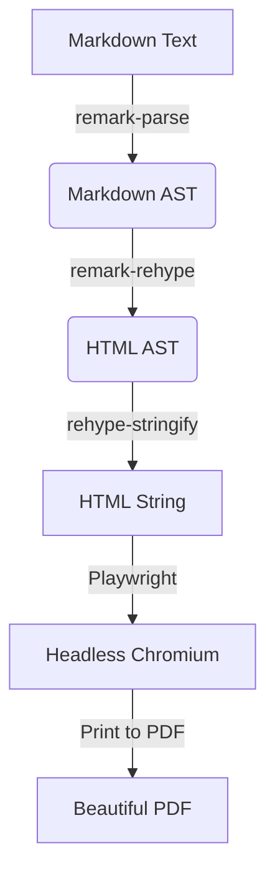

# I Couldn't Find a Markdown to PDF Tool That Just Worked, So I Built One (@amitdevx/md2pdf)


## 1. Introduction

Have you ever tried converting a beautifully formatted Markdown document into a PDF, only to end up with a mess of broken styles, misaligned code blocks, and ruined formatting? I faced this exact problem recently. I needed to generate professional-looking PDFs from my Markdown notes, but the existing tools just didn't satisfy my needs. They were either too complex to configure, or simply produced ugly results out of the box.

So, I built a production-quality Markdown to PDF rendering engine: **[`@amitdevx/md2pdf`](https://www.npmjs.com/package/@amitdevx/md2pdf)**.

## 2. The Problem with Existing Markdown to PDF Converters

When I tested existing Markdown-to-PDF converters on npm and GitHub, I ran into a wall of frustrating issues:

- **Poor print formatting:** Page breaks appearing in the middle of code blocks or headers getting stranded at the bottom of a page.
- **Inconsistent CSS:** The generated HTML looked fine in a browser, but the PDF output was entirely different because of poor print stylesheet handling.
- **Browser print issues:** Tools relying on deprecated libraries like `wkhtmltopdf` or old headless browsers struggled with modern CSS features.
- **Old libraries:** Many existing npm packages were abandoned years ago, throwing dependency warnings or failing on newer Node.js versions.
- **Weak typography:** Default fonts and spacing that looked like they belonged in 1995.

## 3. Designing md2pdf: The Architecture

Before writing a single line of code, I researched the existing ecosystem. I didn't want to reinvent the wheel. I decided against Pandoc (steep learning curve) and Marp (built for presentations, not docs). 

Instead, I chose the **unified** ecosystem (Remark/Rehype) for robust Abstract Syntax Tree (AST) manipulation, and **Playwright** to drive headless Chromium for pixel-perfect PDF rendering.

Here is the exact rendering pipeline I implemented for `md2pdf`:



**Why this approach?**
By using `remark-parse` and `remark-rehype`, the parser is incredibly robust. I also included `remark-gfm` natively to support GitHub Flavored Markdown (tables, strikethroughs) out of the box. By passing the final HTML to Playwright, I ensure the PDF engine has full support for modern CSS and flexbox formatting.

## 4. Current State: v0.3.0 Features & Usage

The tool is live on npm at **v0.3.0**! Right now, it perfectly handles standard Markdown-to-PDF conversion with clean typography, alongside native support for **Mermaid architecture diagrams**, **KaTeX/mhchem offline math rendering**, and **strict security mitigations** against SSRF and XSS attacks.

You can use it as a CLI tool or as a Node.js library.

### As a CLI Tool

You can run it instantly using `npx` (no installation required), or install it globally:

```bash
# Global install
npm install -g @amitdevx/md2pdf

# Convert a single file
md2pdf README.md

# Convert an entire directory!
md2pdf docs/

# Specify a custom output path
md2pdf input.md --output custom.pdf
```

### As a Node.js Library

If you want to build your own tools or generate PDFs programmatically, you can embed the rendering engine directly:

```typescript
import { convert } from '@amitdevx/md2pdf';

await convert({
  input: 'README.md',
  output: 'README.pdf'
});
```

## 5. Building and Publishing to npm

Building a modern Node.js tool from scratch taught me a lot about the current ecosystem:
- **`commander`, `ora`, & `picocolors`:** The holy trinity for building beautiful, responsive CLI interfaces.
- **TypeScript & `tsup`:** The entire project is strictly typed, and `tsup` made bundling the CLI (CJS) and Library (ESM) incredibly fast with zero configuration.
- **`vitest`:** I used Vitest for the testing framework-it is remarkably fast.
- **Publishing Hurdles:** Automating the npm publish pipeline via GitHub Actions, handling 2FA, and dealing with Playwright caching in CI runners took significant effort.

If you are building open source today, treat your side projects with the same CI/CD rigor as your day job!

## 6. The Roadmap: What's Coming Next?

While v0.3.0 handles a massive suite of features beautifully (including Mermaid, KaTeX, and advanced theming), I built this AST-based architecture specifically to be extensible. Here is what is actively in development for upcoming updates:

- **Obsidian Compatibility:** Parsing and rendering those handy `> [!note]` callouts, embeds, and `[[internal wiki links]]`.
- **Plugin System:** Allowing users to inject their own remark/rehype plugins via a config file.

## 7. Resources & Links

If you are looking for a simple, modern, and reliable Markdown to PDF converter, give it a try. I would love for you to test it out and leave some feedback!

- **npm Package:** [@amitdevx/md2pdf](https://www.npmjs.com/package/@amitdevx/md2pdf)
- **GitHub Repository:** [github.com/amitdevx/md2pdf](https://github.com/amitdevx/md2pdf) *(Drop a ⭐️ if you find it useful!)*
- **Issue Tracker:** [Report a bug or request a feature](https://github.com/amitdevx/md2pdf/issues)

---

## Connect With Me

- **GitHub**: [@amitdevx](https://github.com/amitdevx)
- **LinkedIn**: [Amit Divekar](https://www.linkedin.com/in/divekar-amit/)
- **X / Twitter**: [@amitdevx_](https://x.com/amitdevx_)
- **Instagram**: [@amitdevx](https://instagram.com/amitdevx)
