# Output Filtering vs. Thought Suppression


When we talk about AI safety, it often sounds like there's just one obvious place to enforce rules: simply tell the model what it shouldn't do, and then check what it produces.

But out in the real world - in production systems - the reality is much more complicated.

A modern AI system can enforce safety through **model-level alignment**, **input filtering**, **reasoning-time controls**, **retrieval and tool validation**, **output filtering**, and, for image generation, even **interventions inside the latent generation process**.

This raises a core architectural question:

> **Should safety primarily come from suppressing unsafe behavior inside the model, or from filtering what comes out of the model?**

The honest answer? Neither.

The best approach is **defense in depth**. We need multiple independent layers, each designed to catch a different kind of failure.

---

## 1. Two Different Ideas: Thought Suppression vs. Output Filtering

Before comparing architectures, it is useful to separate two concepts that are often mixed together.

### Thought suppression

What we might loosely call **thought suppression** refers to safety behavior learned or enforced close to the model's generation process.

For language models, this includes:

- supervised fine-tuning,
- RLHF and related preference optimization,
- safety post-training,
- refusal behavior,
- reasoning-time safety mechanisms,
- and other techniques intended to make the model itself less likely to produce unsafe reasoning or content.

This is **not literal deterministic censorship of thoughts**.

An aligned model is still a probabilistic system. It has learned behavioral preferences rather than gained a conventional security firewall.

### Output filtering

**Output filtering** happens outside the main generation process.

The model produces a candidate response, and another system decides whether that response should be:

- allowed,
- modified,
- rejected,
- replaced,
- or sent through another validation stage.

A simplified architecture looks like this:

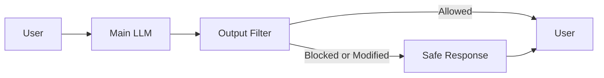

This distinction is the foundation of the rest of the discussion.

---


---

# 2. Internal Alignment: Teaching the Model to Behave Safely

Internal alignment attempts to make safe behavior part of the model's learned behavior.

A common post-training approach is **Reinforcement Learning from Human Feedback (RLHF)**. Human preferences are used to guide the model toward responses that are considered more desirable.

For example, Meta's documentation around Llama 3 describes safety and helpfulness reward models, human feedback, fine-tuning, and adversarial evaluation as parts of its safety process.

**Source:** [Meta AI: Llama 3 and Responsible AI](https://ai.meta.com/blog/meta-llama-3-meta-ai-responsibility/)

It is tempting to describe this as the model learning to "suppress harmful thoughts." That wording is useful as an intuition, but technically it is too strong.

The model does not contain a simple internal rule such as:

```text
IF harmful_thought:
    STOP
```

Instead, training changes the model's statistical behavior so that some continuations become less likely and safer responses become more likely.

That distinction matters.

If alignment were a perfect security boundary, external moderation would be unnecessary.

In practice, it is not.

---

## 2.1 Why Internal Alignment Can Fail

Modern reasoning models introduce another problem: the model may generate substantially longer internal reasoning sequences before producing its final answer.

That creates more room for safety-relevant behavior to interact with:

- long contexts,
- adversarial instructions,
- intermediate reasoning,
- attention allocation,
- prompt injection,
- and compositional attacks.

Research on **Chain-of-Thought Hijacking** reported that long sequences of seemingly harmless reasoning can be used to obscure harmful objectives and reduce refusal behavior in reasoning models.

**Source:** [arXiv: Chain-of-Thought Hijacking](https://arxiv.org/abs/2510.26418)

A related H-CoT study investigated attacks against reasoning models including o1/o3, DeepSeek-R1, and Gemini 2.0 Flash Thinking and reported significant reductions in refusal rates under its attack methodology.

**Source:** [arXiv: H-CoT: Hijacking the Chain-of-Thought](https://arxiv.org/abs/2502.12893)

Long-context research provides another warning: safety alignment can degrade as context length increases, including through attacks that distribute harmful intent across otherwise innocuous pieces of context.

**Source:** [arXiv: Long-context safety research](https://arxiv.org/abs/2602.08874)

The architectural lesson is important:

> **A model's learned safety behavior should not be treated as the application's only security boundary.**

---


---

# 3. Output Filtering: A Second Line of Defense

Output filtering takes a different approach.

Instead of asking:

> "Can the model always avoid unsafe generation?"

the application asks:

> "Even if the model generates something unsafe, can we stop it before it reaches the user?"

This creates a separate security boundary.

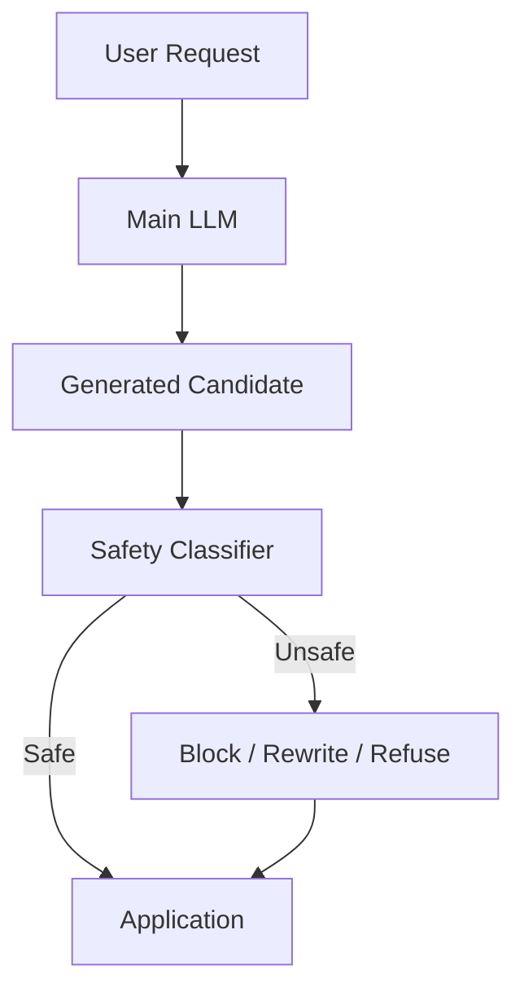

This is powerful because the filtering layer does not have to rely entirely on the main model's learned behavior.

However, it is important not to overstate this advantage.

**External does not automatically mean unbreakable.**

If the output filter is itself an LLM, then it is still a probabilistic model and can have:

- false positives,
- false negatives,
- adversarial weaknesses,
- distribution-shift problems,
- taxonomy limitations,
- latency,
- and cost.

The strongest design therefore combines **learned classifiers with deterministic controls**.

---

# 4. Llama Guard: A Dedicated Safety Model

One example of output/input filtering is **Llama Guard**.

Meta introduced Llama Guard as an LLM-based input/output safeguard for human-AI conversations.

It can classify:

- user prompts,
- model responses,
- and safety categories defined by a safety taxonomy.

Meta describes Llama Guard as a language model performing multi-class classification and producing binary safety decisions.

**Source:** [Meta AI: Llama Guard](https://ai.meta.com/research/publications/llama-guard-llm-based-input-output-safeguard-for-human-ai-conversations/)

A simplified architecture is:

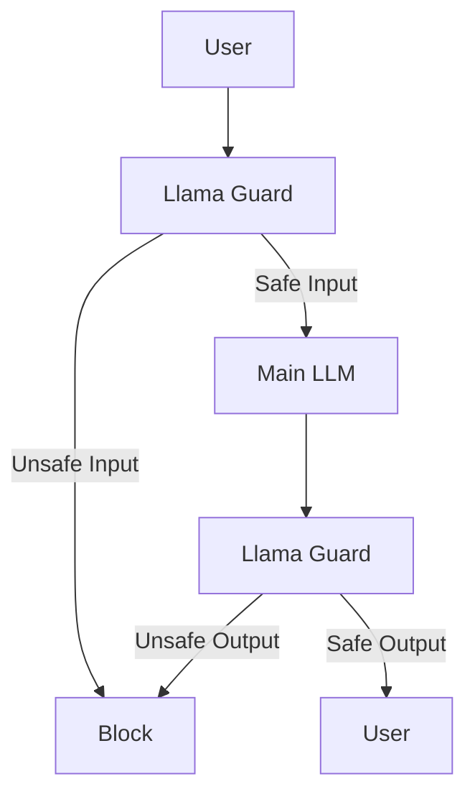

This gives the application two opportunities to stop unsafe behavior:

1. **before generation**, and
2. **after generation**.

That is already stronger than output-only moderation.

---


---

# 5. Programmatic Validators: The Other Side of the Equation

Now consider a completely different safety mechanism.

Suppose the LLM generates:

```json
{
  "action": "delete_user",
  "user_id": "123"
}
```

A safety classifier might determine whether the request appears dangerous.

But a deterministic validator can guarantee something much simpler:

- Is the JSON valid?
- Does `action` belong to the allowed enum?
- Is `user_id` correctly formatted?
- Are required fields present?

These are properties that do not require an LLM.

That is where frameworks such as **Guardrails AI** become useful.

**Source:** [Guardrails AI](https://guardrailsai.com/)

Guardrails AI focuses heavily on validators and structured output reliability.

Its validator architecture allows an application to define what should be checked and what should happen when validation fails.

**Source:** [Guardrails AI: Validators](https://guardrailsai.com/guardrails/docs/concepts/validators)

The conceptual pipeline is:

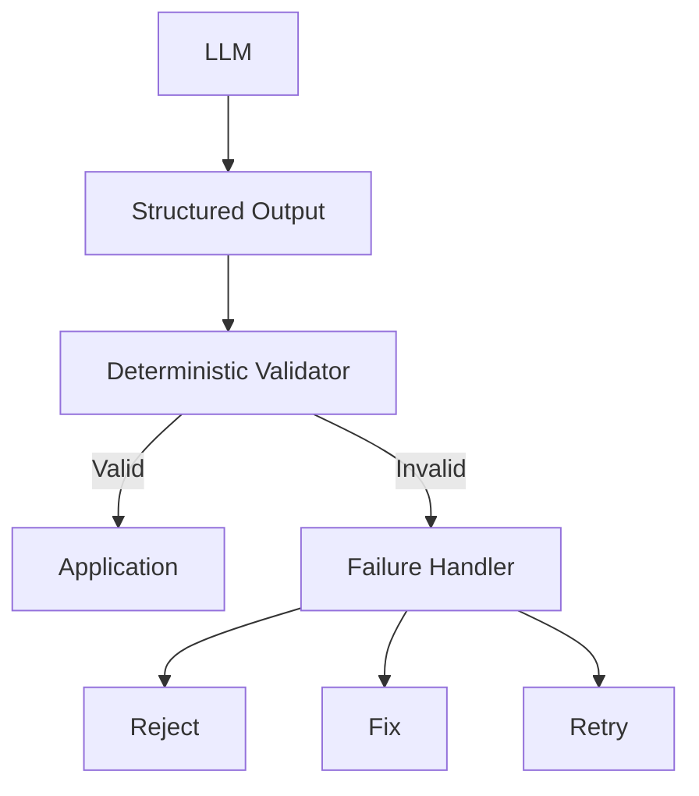

This reveals an important limitation of purely programmatic validation.

A schema can tell us:

> "This is valid JSON."

It cannot tell us:

> "The user is authorized to delete this particular account."

That requires **authorization and policy logic**.

---

# 6. Deterministic Validation vs. Semantic Moderation

The two approaches are not competitors.

They operate at different abstraction levels.

| Property | Deterministic Validator | LLM Safety Classifier |
|---|---|---|
| JSON/schema validation | Excellent | Unnecessary |
| Regex/pattern checks | Excellent | Unnecessary |
| Known PII patterns | Excellent | Useful for context |
| Semantic harmfulness | Weak | Stronger |
| Contextual intent | Weak | Stronger |
| Business rules | Excellent | Unreliable |
| Jailbreak detection | Limited | Stronger |
| Predictability | Very high | Probabilistic |
| Latency | Usually low | Higher |
| Cost | Usually low | Higher |
| Explainability | High | Variable |

The correct architectural question is therefore not:

> **"Which one should I use?"**

It is:

> **"Which safety property should each layer be responsible for?"**

---


---

# 7. NeMo Guardrails: Combining the Layers

[NVIDIA NeMo Guardrails](https://docs.nvidia.com/nemo-guardrails/index.html) demonstrates why modern guardrail systems are broader than a simple output filter.

NVIDIA documents five major rail stages:

1. **Input rails**
2. **Retrieval rails**
3. **Dialog rails**
4. **Execution rails**
5. **Output rails**

**Source:** [NVIDIA: Guardrails sequence diagrams](https://docs.nvidia.com/nemo/guardrails/reference/guardrails-sequence-diagrams)

NVIDIA's configuration documentation explicitly describes these stages as:

- input validation/filtering,
- retrieved-context processing,
- conversation-flow control,
- tool/action control,
- and output validation/filtering.

**Source:** [NVIDIA: Guardrails configuration](https://docs.nvidia.com/nemo/guardrails/configure-guardrails/yaml-schema/guardrails-configuration)

The architecture therefore looks much more like this:

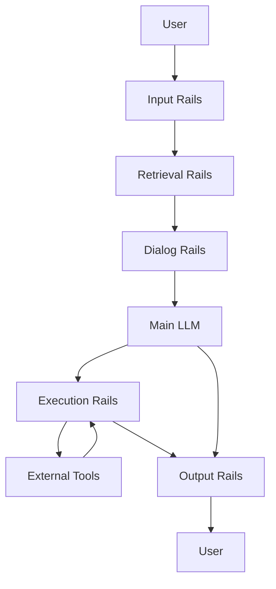

This is a major shift in thinking.

Safety is no longer simply:

```text
Input → LLM → Output Filter
```

It becomes:

```text
Input
  ↓
Retrieval
  ↓
Conversation
  ↓
Reasoning
  ↓
Tools
  ↓
Output
```

with policy enforcement throughout the lifecycle.

---

# 8. Why Output Filtering Is Not Enough for Agents

The difference becomes especially important with autonomous agents.

A normal chatbot might produce:

```text
User → LLM → Response
```

An agent might do this:

```text
User
 ↓
LLM
 ↓
Search web
 ↓
Read document
 ↓
Call API
 ↓
Modify database
 ↓
Send email
 ↓
Return response
```

The dangerous action might occur **before the final response exists**.

If an output filter only sees the final text, it may be too late.

For example:

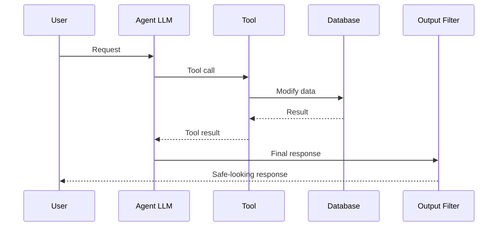

The final response could be completely harmless while the dangerous database modification has already happened.

This is why **authorization, tool validation, sandboxing, and execution controls** are more important for agents than they are for ordinary chat.

NVIDIA's NeMo Guardrails documentation explicitly includes execution rails for controlling and validating tool/function calls and their inputs and outputs.

**Source:** [NVIDIA: Guardrail types](https://docs.nvidia.com/nemo/guardrails/latest/about-nemo-guardrails-library/rail-types)

---


---

# 9. Output Filtering Has a Fundamental Blind Spot

There is a deeper problem with output filtering:

> **It can only inspect what it receives.**

If the model internally considers an unsafe strategy but eventually produces a harmless answer, an output filter may never see the dangerous intermediate reasoning.

Conversely, if a dangerous action happens through a tool call, an output filter applied only to the final text cannot undo that action.

This is why modern safety architecture increasingly moves controls **closer to the action being protected**.

For example:

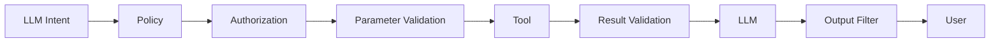

Notice that the output filter is still useful.

It is simply no longer the only control.

---

# 10. Image Generation: Safety Can Move Into the Latent Space

Text generation and image generation provide an interesting contrast.

For text:

```text
Prompt → Tokens → Response
```

For diffusion-based image generation:

```text
Prompt → Conditioning → Iterative Denoising → Image
```

The image is created through many denoising steps in latent space.

That creates an opportunity to intervene **during generation itself**.

---

# 10.1 Safe Latent Diffusion

**Safe Latent Diffusion (SLD)** was proposed as a method for mitigating inappropriate image generation without retraining the underlying diffusion model.

The technique modifies the denoising process using a safety guidance direction.

**Source:** [arXiv: Safe Latent Diffusion](https://arxiv.org/abs/2211.05105)

The official implementation integrates SLD into Stable Diffusion.

**Source:** [GitHub: Safe Latent Diffusion](https://github.com/ml-research/safe-latent-diffusion)

Conceptually:

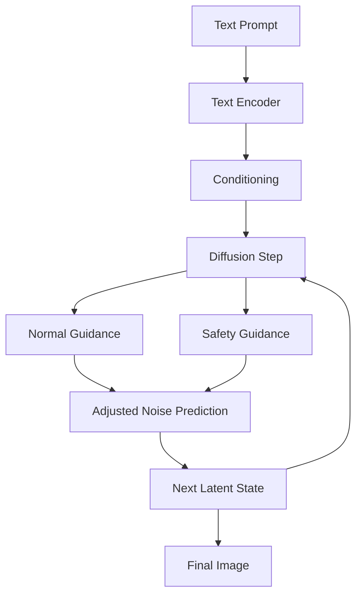

This is fundamentally different from simply rejecting a prompt.

Instead of:

```text
Unsafe prompt → Block
```

the idea is closer to:

```text
Unsafe direction → Steer generation away
```

---

# 10.2 The Mathematical Idea

Let:

- `x_t` be the current noisy latent,
- `c` be the desired text conditioning,
- `s` represent an unsafe concept,
- `E` represent the model's noise prediction.

A simplified representation of the safety adjustment is:

`Adjusted Noise = E(x_t, c) - gamma * [ E(x_t, s) - E(x_t, empty) ]`

where:

- `E(x_t, c)` is the normal conditional prediction,
- `E(x_t, s)` represents the unsafe-concept direction,
- `E(x_t, empty)` represents the unconditional prediction,
- `gamma` controls the strength of the safety intervention.

Notice that the safety mechanism changes the **latent denoising trajectory**.

It is not simply an output moderation step.

The actual SLD method includes additional mechanisms and hyperparameters, so this equation should be treated as an **illustrative formulation**, not a complete implementation specification.

**Source:** [CVPR 2023: Safe Latent Diffusion](https://openaccess.thecvf.com/content/CVPR2023/papers/Schramowski_Safe_Latent_Diffusion_Mitigating_Inappropriate_Degeneration_in_Diffusion_Models_CVPR_2023_paper.pdf)

---


---

# 11. A Unified Defense-in-Depth Architecture

All of these ideas can be combined into one architecture.

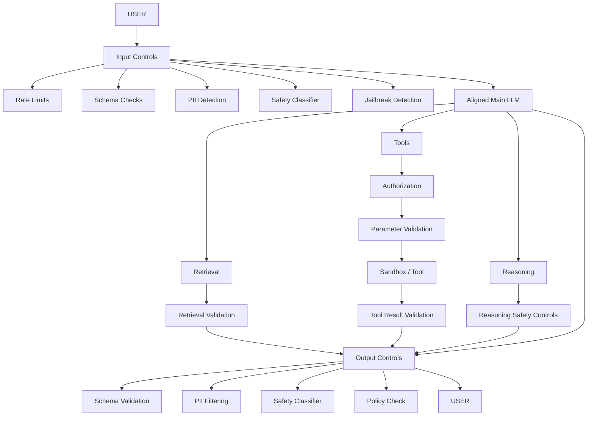

This architecture contains several independent layers:

### Layer 1: Model Alignment

Make the model itself more likely to behave safely.

### Layer 2: Input Controls

Stop obviously dangerous or malformed requests before expensive generation.

### Layer 3: Retrieval Controls

Prevent unsafe or untrusted retrieved information from becoming trusted context.

### Layer 4: Reasoning Controls

Account for attacks involving long reasoning, context manipulation, or jailbreak strategies.

### Layer 5: Execution Controls

Treat tools as security-sensitive capabilities.

### Layer 6: Output Controls

Inspect what the model is actually about to return.

### Layer 7: Conventional Security

Keep authentication, authorization, sandboxing, rate limiting, and resource controls outside the LLM.

This is the critical distinction:

> **An LLM should participate in security decisions, but it should not own the entire security boundary.**

---

# 12. The Real Answer: Neither Alone

So, should we use **thought suppression** or **output filtering**?

Neither is sufficient by itself.

Internal alignment provides a first layer of behavioral safety.

Output filtering provides an independent external check.

Deterministic validators provide guarantees for properties that can be precisely defined.

Safety classifiers provide semantic understanding where simple rules are insufficient.

Authorization protects actions.

Sandboxing limits damage.

Monitoring provides visibility.

Adversarial testing finds failures before attackers do.

The resulting architecture looks like:

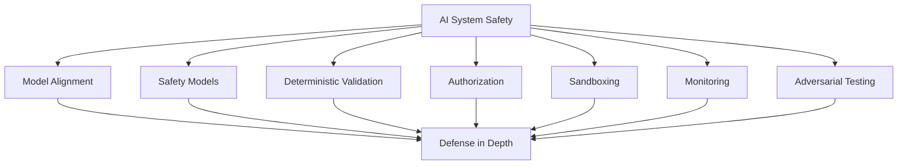

---

# 13. What Each Layer Is Actually Good At

| Layer | Primary Responsibility | Main Strength | Main Weakness |
|---|---|---|---|
| Model alignment | Behavioral safety | Safety is built into model behavior | Can fail under adversarial conditions |
| Input filtering | Request screening | Stops known bad inputs early | Cannot predict all downstream behavior |
| Safety classifier | Semantic moderation | Understands contextual risk | Probabilistic |
| Deterministic validator | Formal constraints | Predictable and testable | Limited semantic understanding |
| Retrieval guardrail | Context protection | Filters untrusted retrieved data | Requires correct retrieval policy |
| Execution guardrail | Tool safety | Controls actions before/after execution | Must be correctly configured |
| Output filter | Response safety | Independent final check | Too late for already-executed actions |
| Authorization | Permission control | Strong security boundary | Requires explicit policy |
| Sandboxing | Damage containment | Limits blast radius | Does not decide whether an action is desirable |
| Monitoring | Detection and audit | Makes failures observable | Does not prevent every failure |

---

# 14. The Architectural Principle

The most important lesson is not that output filtering is better than internal alignment.

It is this:

> **Different safety mechanisms should protect different boundaries.**

If the model generates unsafe text, output filtering can catch it.

If the model requests an unauthorized tool call, authorization should stop it.

If the model generates malformed JSON, deterministic validation should reject it.

If retrieved content contains malicious instructions, retrieval controls should isolate it.

If a model attempts an unsafe action inside a sandbox, the sandbox should constrain its impact.

If the model's learned refusal behavior is bypassed by a long-context attack, external controls should still provide another layer.

This is what **defense in depth** actually means in an AI system.

---

# 15. Final Architecture

A production-oriented AI backend can therefore be summarized as:

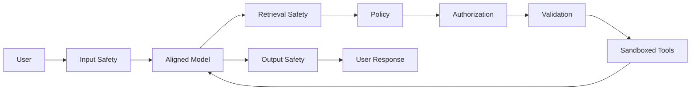

The architecture deliberately avoids making one component responsible for everything.

That is the central lesson of modern AI moderation:

> **Don't ask one model to be the entire security system.**

A robust AI backend combines:

**aligned models + specialized safety models + deterministic validators + authorization + sandboxing + monitoring + adversarial testing.**

Output filtering is important.

Thought-level or model-level safety is important.

But the strongest systems do not choose between them.

They **layer them**.

---

## Sources

1. [Meta AI: Llama 3 and Responsible AI](https://ai.meta.com/blog/meta-llama-3-meta-ai-responsibility/)
2. [arXiv: Chain-of-Thought Hijacking](https://arxiv.org/abs/2510.26418)
3. [arXiv: H-CoT: Hijacking the Chain-of-Thought](https://arxiv.org/abs/2502.12893)
4. [arXiv: Long-context safety research](https://arxiv.org/abs/2602.08874)
5. [Meta AI: Llama Guard](https://ai.meta.com/research/publications/llama-guard-llm-based-input-output-safeguard-for-human-ai-conversations/)
6. [Guardrails AI](https://guardrailsai.com/)
7. [Guardrails AI: Validators](https://guardrailsai.com/guardrails/docs/concepts/validators)
8. [NVIDIA: NeMo Guardrails](https://docs.nvidia.com/nemo-guardrails/index.html)
9. [NVIDIA: Guardrails sequence diagrams](https://docs.nvidia.com/nemo/guardrails/reference/guardrails-sequence-diagrams)
10. [NVIDIA: Guardrails configuration](https://docs.nvidia.com/nemo-guardrails/configure-guardrails/yaml-schema/guardrails-configuration)
11. [NVIDIA: Guardrail types](https://docs.nvidia.com/nemo/guardrails/latest/about-nemo-guardrails-library/rail-types)
12. [arXiv: Safe Latent Diffusion](https://arxiv.org/abs/2211.05105)
13. [GitHub: Safe Latent Diffusion](https://github.com/ml-research/safe-latent-diffusion)
14. [CVPR 2023: Safe Latent Diffusion](https://openaccess.thecvf.com/content/CVPR2023/papers/Schramowski_Safe_Latent_Diffusion_Mitigating_Inappropriate_Degeneration_in_Diffusion_Models_CVPR_2023_paper.pdf)

---

## Connect With Me

- **GitHub**: [@amitdevx](https://github.com/amitdevx)
- **LinkedIn**: [Amit Divekar](https://www.linkedin.com/in/divekar-amit/)
- **X / Twitter**: [@amitdevx_](https://x.com/amitdevx_)
- **Instagram**: [@amitdevx](https://instagram.com/amitdevx)

If you have any questions or want to discuss this topic further, feel free to reach out!