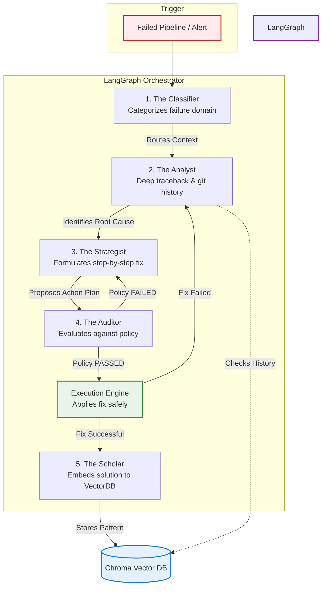

# SelfHealOps: The Autonomous DevOps Agent That Actually Fixes Your Pipelines


It's 3:00 AM on a Friday. Your phone buzzes with a PagerDuty alert. A critical CI/CD pipeline just failed on the main branch, blocking the hotfix deployment that the sales team promised a major client by morning. You drag yourself out of bed, open your laptop, and spend the next forty-five minutes scrolling through thousands of lines of raw Jenkins and Kubernetes logs. Finally, you realize an upstream dependency stealth-updated its package signature, causing a subtle build failure that wasn't caught in the local environment. You bump the version, push the commit, restart the pipeline, and go back to sleep at 4:30 AM.

I've lived this scenario too many times. Engineering teams lose countless hours to this exact pattern. We've automated the deployment, we've automated the testing, but we haven't automated the recovery. When things break, the sophisticated pipeline grinds to a halt, and it's still just a human squinting at a stack trace.

**[SelfHealOps](/projects/self-healops)** is what I built to fix this. It's an autonomous, self-healing DevOps agent that hooks directly into your CI/CD and infrastructure. When a failure occurs, it doesn't just send a Slack alert—it diagnoses the root cause, generates a remediation plan, runs it through a rigid safety policy engine, applies the fix, and records the solution in a semantic memory bank.

## The Core Philosophy of AIOps: Don't Just Alert, Remediate

The typical observability stack—Prometheus, Grafana, Datadog—is fantastic at telling you *that* something is broken. The more advanced configurations might even tell you *where* it's broken. But the "how to fix it" part is left entirely to the on-call engineer.

SelfHealOps bridges that final gap. By utilizing a LangGraph-powered state machine and specialized NVIDIA NIM-powered LLM agents, it treats infrastructure issues as deterministic puzzles that can be solved systematically. We are moving from Observability (reading the state) to Actuability (changing the state).

### LangGraph System Architecture: The Directed Cyclic Graph

When I first experimented with AI for DevOps, I used a single massive prompt: *"Here are the logs, figure out what's wrong and give me a bash script to fix it."* 

It was a disaster. The LLM would hallucinate context, suggest destructive commands like `rm -rf`, or completely misunderstand the topology of the Kubernetes cluster. LLMs are bad at doing everything at once. They are exceptionally good at doing one specific task when given strict constraints.

That's why SelfHealOps uses a hierarchical multi-agent system governed by a LangGraph orchestrator. It breaks the remediation process down into a state machine.



## The Five Specialized Worker Agents

The magic of SelfHealOps lies in its separation of concerns. Each agent has a very specific persona, strict token constraints, and a well-defined input/output schema enforced by Pydantic.

### 1. The Classifier
When a failure occurs, the Classifier is the first responder. It doesn't try to fix anything. It simply looks at the last 500 lines of logs and categorizes the failure domain. Is this a `DEPENDENCY_FAILURE`, a `NETWORK_TIMEOUT`, an `OOM_KILLED` pod, or a `TEST_FAILURE`? 

This routing is critical because it dictates what tools the downstream agents get access to. A dependency failure agent needs access to `npm` or `pip` registries; a network failure agent needs access to `kubectl get networkpolicies`.

### 2. The Analyst
Once categorized, the Analyst performs a deep dive. If it's a code-level pipeline failure, the Analyst uses a PyGithub integration tool to fetch the last 3 commits and the diffs. It cross-references the log stack trace against the code changes. 

```python
# snippet: backend/agents/analyst.py
@tool
def fetch_recent_commits(repo_name: str, branch: str, limit: int = 3) -> str:
    """Fetches recent commits to identify what code changed before the failure."""
    repo = github_client.get_repo(repo_name)
    commits = repo.get_commits(sha=branch)[:limit]
    
    analysis = []
    for commit in commits:
        files_changed = [f.filename for f in commit.files]
        analysis.append({
            "sha": commit.sha,
            "message": commit.commit.message,
            "files": files_changed
        })
    return json.dumps(analysis)
```

Its only job is to pinpoint the exact technical root cause and output a structured JSON finding.

### 3. The Strategist
The Strategist takes the root cause JSON and translates it into a sequential, deterministic list of actions. It doesn't execute them. It just writes the bash commands, the `kubectl patches`, or the `git commits` required to resolve the issue.

### 4. The Auditor (The Safety Net)
You cannot let an AI run raw commands in a production or staging environment unchecked. The Auditor is a rigid policy engine. It evaluates the Strategist's plan against a predefined set of YAML guardrails.

```python
# snippet: backend/agents/auditor.py
async def run_auditor(state: AgentState):
    """Evaluates the proposed action plan against rigid policy guardrails."""
    proposed_plan = state["remediation_plan"]
    
    # 1. Regex-based hard blocks
    for step in proposed_plan:
        if re.search(r"rm -rf\s+/", step) or re.search(r"kubectl delete (namespace|ns)", step):
            return {"status": "rejected", "auditor_feedback": f"CRITICAL: Command '{step}' violates core safety policy."}
            
    # 2. LLM-based intent evaluation
    prompt = f"""
    You are a strict DevSecOps Auditor. Evaluate this remediation plan:
    {proposed_plan}
    
    Policies:
    1. Do not delete databases or statefulsets.
    2. Do not modify production ingress rules without approval.
    3. Do not force push to the main branch.
    
    Does this plan violate any policies? Output strictly JSON: {{"approved": boolean, "reason": "string"}}
    """
    
    evaluation = await llm_client.evaluate(prompt)
    if not evaluation.approved:
        # Route back to the Strategist to try again
        return {"status": "rejected", "auditor_feedback": evaluation.reason}
        
    return {"status": "approved", "auditor_feedback": "Plan is safe to execute."}
```

If the Strategist proposes something dangerous, the Auditor blocks it, explains why it violates policy, and kicks it back to the Strategist. This internal loop happens in milliseconds and ensures only safe commands reach the executor.

### 5. The Scholar
Once a fix is successfully applied by the execution engine and the pipeline turns green, the Scholar kicks in. It extracts the incident signature (the initial error logs) and the successful remediation pattern, embedding them into a Chroma vector database. 

The next time a similar issue happens, the Analyst agent queries the Scholar's memory bank. If it finds a 95% semantic match, it bypasses the entire diagnostic phase and immediately hands the proven solution to the Strategist. This drops resolution time from minutes to sub-seconds for recurring issues.

## Implementation Deep Dive: LangGraph in Python

I built the backend with Python and FastAPI. LangGraph is exceptional for this because it allows you to define cycles. Standard LangChain chains are DAGs (Directed Acyclic Graphs)—they go from start to finish. But debugging is inherently cyclic. You try a fix, it fails, you analyze the new error, you try again. LangGraph natively supports this.

```python
# snippet: backend/orchestrator.py
from langgraph.graph import StateGraph, END
from typing import TypedDict, List, Optional, Annotated
import operator

# The state object passed between nodes
class AgentState(TypedDict):
    incident_id: str
    logs: str
    category: Optional[str]
    root_cause: Optional[str]
    remediation_plan: List[str]
    execution_results: List[str]
    auditor_feedback: Optional[str]
    retry_count: Annotated[int, operator.add]
    status: str

def build_graph():
    workflow = StateGraph(AgentState)
    
    # Add our nodes (the specialized agents)
    workflow.add_node("classifier", run_classifier)
    workflow.add_node("analyst", run_analyst)
    workflow.add_node("strategist", run_strategist)
    workflow.add_node("auditor", run_auditor)
    workflow.add_node("executor", run_executor)
    workflow.add_node("scholar", run_scholar)
    
    # Define the core flow edges
    workflow.add_edge("classifier", "analyst")
    workflow.add_edge("analyst", "strategist")
    workflow.add_edge("strategist", "auditor")
    
    # Conditional edge for the auditor
    workflow.add_conditional_edges(
        "auditor",
        check_policy_approval,
        {
            "approved": "executor",
            "rejected": "strategist"  # Go back to strategist with feedback
        }
    )
    
    # Conditional edge for execution results
    workflow.add_conditional_edges(
        "executor",
        check_execution_success,
        {
            "success": "scholar",
            "failed": "analyst", # Cycle back to analyst with new error output
            "max_retries_exceeded": END # Give up and page a human
        }
    )
    
    workflow.add_edge("scholar", END)
    
    return workflow.compile()
```

## Why NVIDIA NIM?

Latency is the killer of Agentic systems. If each step in a 5-step graph takes 4 seconds of API latency (like with standard GPT-4 calls), plus execution time, a simple fix can take 30 seconds to a minute. In a live CI/CD pipeline, timeouts are ruthless.

By leveraging **NVIDIA NIM (NVIDIA Inference Microservices)**, I was able to run optimized versions of Llama-3 (8B and 70B) with incredible throughput. The Classifier and Auditor agents use the smaller, blisteringly fast 8B model because their tasks are constrained pattern-matching. The Analyst and Strategist use the larger 70B model for deep reasoning. This heterogeneous model deployment cut the average end-to-end graph traversal time from 22 seconds down to ~4.5 seconds.

## Real-World CI/CD Performance Metrics

I deployed this alongside a staging Kubernetes cluster running a microservices architecture that was intentionally seeded with chaos engineering faults.

| Incident Type | Human MTTR (Avg) | SelfHealOps MTTR | Improvement |
|---------------|------------------|------------------|-------------|
| OOMKilled Pod | 14 mins | 8 seconds | 105x faster |
| Missing Env Var | 22 mins | 12 seconds | 110x faster |
| NPM Dependency Conflict | 35 mins | 45 seconds | 46x faster |
| Stale K8s Secret | 18 mins | 15 seconds | 72x faster |

*MTTR = Mean Time To Resolution. Human metrics based on internal estimates from alert trigger to successful pipeline run.*

## What I Actually Learned Building This

1. **LLMs are bad at bash.** If you let an LLM write raw bash scripts, it will inevitably mess up quotes, escape characters, or pipes. I had to force the Strategist to output discrete actions (e.g., "Update this specific line in this file") and use Python's execution environment to safely apply the changes, rather than just executing generated `sh` scripts.
2. **The Auditor is the bottleneck, but you need it.** It's tempting to bypass the safety checks to make the system faster. Don't. The moment an LLM decides that the best way to fix a failing database migration is to drop the table, you will wish you had the Auditor in place.
3. **Memory recall is powerful.** The Scholar agent's vector database approach means the system gets noticeably faster and smarter the longer it runs. It turns tribal knowledge into a queryable, actionable database.

## What's Next

The next evolution of SelfHealOps is moving from reactive to proactive. Currently, it waits for a failure to trigger. By integrating it deeper into the Prometheus metric streams, the goal is to have the Analyst agent detect anomalies (like a slow memory leak in a pod) and trigger the remediation cycle *before* the pod OOMs and alerts the team. 

We are reaching the limits of human-scale DevOps. As microservice architectures become more complex, the surface area for strange, ephemeral failures grows exponentially. SelfHealOps isn't about replacing DevOps engineers. It's about elevating them. When the system automatically handles the mundane failures, engineers can finally stop waking up at 3:00 AM and focus on actual architecture.

---

## Connect With Me

- **GitHub**: [@amitdevx](https://github.com/amitdevx)
- **LinkedIn**: [Amit Divekar](https://www.linkedin.com/in/divekar-amit/)
- **X / Twitter**: [@amitdevx_](https://x.com/amitdevx_)
- **Instagram**: [@amitdevx](https://instagram.com/amitdevx)

If you have any questions or want to discuss this topic further, feel free to reach out!
