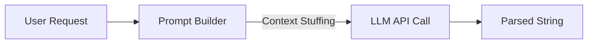

# The End of AI Loops: Why Graph Engineering is the Future


If you have been coding machine learning applications since 2008, you know how this industry has seen many fundamental changes in technology and approaches. I remember hand-writing my own CUDA kernels to speed up Support Vector Machines, crafting feature pipelines for Random Forests, and staying up all night adjusting convergence rate parameters on primitive deep neural networks.

But, nothing in the last 18 years can compare to the pace at which our industry has transformed since 2022. In four years, we have gone from working with Large Language Models as simple string-to-string APIs to developing deterministic, multi-agent cognitive operating systems.

If your backend design is still thinking about AI agents as black box loops, you will soon run into limitations in terms of performance and inefficiencies using API tokens as well as edge cases. Here is a deep dive into how we got here - and how to code for this paradigm in production. 
---


---

## Era 1: Single Prompt Engineering (2022-2024)

### *Stateless Execution and Natural Language Alchemy*

When LLMs were first introduced into production systems, there were very few changes made in terms of architecture. To the back end, an LLM was simply an endpoint with high latency that took a string and gave out a string.

### The System Topology

In this phase, execution was purely linear and stateless:

$$\text{User Request} \longrightarrow \text{System Prompt + Context} \longrightarrow \text{LLM Inference} \longrightarrow \text{Parsed Output}$$



### Engineering Limitations

* **Context Window Abuse:** To ensure accurate results, the developers had to do "context stuffing," whereby all the system rules, DB schema, user history, and Few-Shot examples were placed into one huge prompt.
* **Very Sensitive to Model Changes:** Small changes to the model on the side of the providers could result in different attention weights being given, thus making the JSON parsers generate incorrect syntax.
* **No Fault Tolerance:** In case the model missed any requirement at the middle of 2,000 tokens generation process, the whole call was dropped without any step-by-step retries. 

---

## Era 2: The Agentic Loop Paradigm (2024-2025)

### *Dynamic Execution via the ReAct Cycle*

In order to create systems that would be able to take multiple steps, such as looking through the database, performing shell commands, or querying several APIs, an **LLM execution strategy** called ReAct (Reason + Act) was introduced.

Instead of giving out the result in one go, the LLM was put into an execution loop:

$$\text{Loop Condition: } \text{While } \text{State} \neq \text{Terminal}$$

1. **Thought:** The model generates its internal reasoning based on current context.
2. **Action:** The model outputs a structured tool invocation (e.g., `{"tool": "execute_sql", "query": "..."}`).
3. **Observation:** The system executes the tool, captures stdout/stderr/JSON, appends it to context, and hands control back to the model.

---


---

### Why Monolithic Loops Fail in Enterprise Production

Although ReAct loops enabled autonomous agents, they soon encountered an architectural problem in complicated systems:

1. **Contamination of Context Window:** Since the outputs of each tool (such as stack traces, raw HTML response, or bulky JSON responses) are appended to the conversation history, attention wanes, cost is incurred non-linearly, and latency is introduced.
2. **The "Death Spiral" or Infinite Loops:** In case the error format generated by the tool is not expected, the LLM ends up calling the tool multiple times without stopping.
3. **Concurrency Missing:** Conventional loops operate linearly. For example, if an agent requires data from five separate REST APIs, the conventional loops call them in series. 

---

## Era 3: Graph-Based State Machines (2025 Onward)

### *Deterministic Control Flow and Explicit Topology*

By 2025, production engineering teams had come to the conclusion that considering an agent-based system in terms of a loop is tantamount to creating an entire program within a single monolithic `while True:` construct.

This paradigm in its most advanced form describes the process of working with cognitive AI in terms of **Directed Acyclic Graphs (DAGs) or Cyclic State Machines**.

---


---

### Core Architectural Concepts

#### 1. Bounded Work Nodes

Node in graph-based agents is a self-contained unit-of-work performer. It can be one of the following:

* Specialized micro-prompt LLM call (example - *SQL Generator Node*)
* Deterministic Python/Go service (example - *Data Sanitizer Node*)
* Human in the loop validation node.

#### 2. Edges & Routers

Edges are transitions from one node to another. Edges aren't driven by an LLM which decides how to transition based on some prompt, but are rather determined programmatically via typed state data:

* **Direct Edge:** Static transition (`Node A` $\rightarrow$ `Node B`)
* **Router:** Dynamic function that makes routing decision based on the state `if state.validation_failed: return "fix_node"`

#### 3. Strongly Typed Global State

Instead of passing an increasingly long list of message texts, nodes work with **typed global State Schema** (Pydantic class or TypedDict). Node gets access to state data, performs its job and returns an update of state fields in the form of a dictionary.

---

## Architectural Deep Dive: Code Implementation

Let me show you the concrete code difference between a legacy ReAct Loop and a modern Graph-Based State Machine.

### The Legacy Way: Unbounded ReAct Loop

```python
# Unbounded ReAct loop that suffers from context pollution and fragile error handling

class LegacyReActAgent:
    def __init__(self, llm_client, tools):
        self.llm = llm_client
        self.tools = tools
        self.history = []

    def run(self, user_goal: str) -> str:
        self.history.append({"role": "user", "content": user_goal})
        
        while True:
            # Context window grows endlessly with every iteration
            response = self.llm.generate(messages=self.history)
            self.history.append({"role": "assistant", "content": response.text})
            
            if response.is_final_answer:
                return response.text
                
            # Execute tool and append raw results to history
            tool_name = response.tool_call.name
            tool_args = response.tool_call.args
            
            try:
                result = self.tools[tool_name].execute(**tool_args)
                # Raw result pollutes context window
                self.history.append({"role": "user", "content": f"Tool Output: {result}"})
            except Exception as e:
                # High risk of infinite retry loops here
                self.history.append({"role": "user", "content": f"Tool Error: {str(e)}"})
```

### The Modern Way: Graph-Based State Machine

Below is a clean, dependency-free Python implementation of a production graph engine supporting typed state, isolated context, parallel execution, and conditional error routing.

```python
import asyncio
from dataclasses import dataclass, field
from typing import Callable, Awaitable, Dict, List, Any, Optional

# 1. Define Strongly-Typed State
@dataclass
class WorkflowState:
    query: str
    code_snippet: Optional[str] = None
    security_audit: Optional[Dict[str, Any]] = None
    performance_audit: Optional[Dict[str, Any]] = None
    errors: List[str] = field(default_factory=list)
    final_output: Optional[str] = None
    retry_count: int = 0

# 2. Node Implementations with Bounded Context
async def code_generator_node(state: WorkflowState) -> Dict[str, Any]:
    """Generates code based on user query."""
    # LLM receives ONLY relevant inputs, keeping context clean
    generated_code = f"def process_data(data):\n    # Optimized implementation for: {state.query}\n    return [x * 2 for x in data]"
    return {"code_snippet": generated_code}

async def security_audit_node(state: WorkflowState) -> Dict[str, Any]:
    """Evaluates security vulnerabilities in parallel."""
    await asyncio.sleep(0.1) # Simulate async inspection
    is_secure = "eval(" not in (state.code_snippet or "")
    return {"security_audit": {"passed": is_secure, "vulnerabilities": []}}

async def performance_audit_node(state: WorkflowState) -> Dict[str, Any]:
    """Evaluates complexity and efficiency in parallel."""
    await asyncio.sleep(0.1) # Simulate async inspection
    return {"performance_audit": {"passed": True, "complexity": "O(N)"}}

async def synthesis_node(state: WorkflowState) -> Dict[str, Any]:
    """Synthesizes reports into final output."""
    output = f"Code:\n{state.code_snippet}\n\nAudits Passed: Security={state.security_audit['passed']}, Performance={state.performance_audit['passed']}"
    return {"final_output": output}

async def error_recovery_node(state: WorkflowState) -> Dict[str, Any]:
    """Explicit error resolution node."""
    return {
        "retry_count": state.retry_count + 1,
        "code_snippet": f"# Fixed version\n{state.code_snippet}",
        "errors": []
    }

# 3. Router Functions
def audit_router(state: WorkflowState) -> str:
    """Programmatic control flow based on typed state conditions."""
    sec_passed = state.security_audit and state.security_audit.get("passed")
    perf_passed = state.performance_audit and state.performance_audit.get("passed")
    
    if sec_passed and perf_passed:
        return "synthesize"
    
    if state.retry_count >= 2:
        return "terminate_with_error"
        
    return "recover"

# 4. Graph Orchestrator
class GraphEngine:
    def __init__(self):
        self.nodes: Dict[str, Callable[[WorkflowState], Awaitable[Dict[str, Any]]]] = {}
        
    def add_node(self, name: str, func: Callable[[WorkflowState], Awaitable[Dict[str, Any]]]):
        self.nodes[name] = func

    async def run(self, initial_state: WorkflowState) -> WorkflowState:
        state = initial_state
        
        # Step 1: Generate Code
        update = await self.nodes["generate"](state)
        for k, v in update.items(): setattr(state, k, v)
        
        # Step 2: Fan-Out / Parallel Execution
        sec_task = self.nodes["audit_security"](state)
        perf_task = self.nodes["audit_performance"](state)
        sec_res, perf_res = await asyncio.gather(sec_task, perf_task)
        
        for k, v in sec_res.items(): setattr(state, k, v)
        for k, v in perf_res.items(): setattr(state, k, v)
        
        # Step 3: Conditional Route Evaluation
        next_action = audit_router(state)
        
        if next_action == "synthesize":
            final_res = await self.nodes["synthesize"](state)
            for k, v in final_res.items(): setattr(state, k, v)
        elif next_action == "recover":
            recovery_res = await self.nodes["recover"](state)
            for k, v in recovery_res.items(): setattr(state, k, v)
            # Re-run synthesis post-recovery
            final_res = await self.nodes["synthesize"](state)
            for k, v in final_res.items(): setattr(state, k, v)
            
        return state

# Execution Example
async def main():
    engine = GraphEngine()
    engine.add_node("generate", code_generator_node)
    engine.add_node("audit_security", security_audit_node)
    engine.add_node("audit_performance", performance_audit_node)
    engine.add_node("synthesize", synthesis_node)
    engine.add_node("recover", error_recovery_node)
    
    state = WorkflowState(query="Process customer orders array efficiently")
    final_state = await engine.run(state)
    print("--- EXECUTION COMPLETE ---")
    print(final_state.final_output)

if __name__ == "__main__":
    asyncio.run(main())
```

---

## Why Enterprise Engineering Demands Graphs

---


---

### Comparison Matrix: Architectural Paradigms

| Architectural Metric | Single Prompt (2022-2024) | ReAct Loop (2024-2025) | Directed Graph (2025+) |
| --- | --- | --- | --- |
| **Execution Flow** | Linear (One-shot) | Monolithic Cycle | Directed Graph / DAG |
| **State Management** | None (Stateless) | Unstructured Chat History | Strongly Typed Schema |
| **Concurrency Support** | No | No (Sequential processing) | Native (Fan-out / Fan-in) |
| **Error Handling** | None | Model-dependent guessing | Deterministic Router Edges |
| **Context Management** | Context Window Stuffing | Accumulative Context Degradation | Isolated Node Contexts |
| **Debugging Method** | Prompt re-wording | Reading multi-turn raw logs | Visual Node State Tracing |
| **Production Readiness** | Prototype only | Low / Flaky | High / Enterprise-grade |

### Key System Benefits

1. **Latency Reduction through Parallelization:**
By sending separate tasks like validation, security scans, and RAG queries in parallel node execution using `asyncio.gather()`, latency is greatly reduced from the sequential loop approach.
2. **Debugging and Unit Testing:**
With graphs, each node becomes a pure or mostly pure function. One can do unit tests for their `SecurityNode` in isolation, without having to run a full agent, by mocking the `State` that the node receives as input.
3. **Human-in-the-loop Integration through Deterministic Checkpoints:**
With graphs, it is possible to have deterministic checkpoints during the execution of the nodes, where we can pause execution, await user feedback before proceeding with state transitions.

---

## Conclusion: Recovering Principles of Software Engineering

Constructing an AI application in 2026 cannot be about playing tricks with prompts or trying to tame a crazy “while true” loop using natural language.

Using the conventional software engineering principles of design - **separation of concerns, state management, and graph-based control flow** - ensures that the system is robust, efficient, and maintainable. Migrating your system to a graph-based state machine is the one change that will do wonders for enterprise scalability.

---

## Connect With Me

- **GitHub**: [@amitdevx](https://github.com/amitdevx)
- **LinkedIn**: [Amit Divekar](https://www.linkedin.com/in/divekar-amit)
- **X / Twitter**: [@amitdevx_](https://x.com/amitdevx_)
- **Instagram**: [@amitdevx](https://instagram.com/amitdevx)
